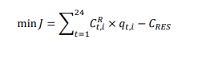
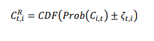
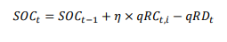

# Energy Storage Optimization

## Project Overview

This project focuses on optimizing energy storage systems by managing charge/discharge schedules to minimize costs and maximize profits. The optimization process leverages **robust optimization**, **price forecasting**, and **Monte Carlo simulations** to handle uncertainties in energy prices and system operations. The goal is to create an efficient system that schedules the charging and discharging of energy storage units to maximize profit while adhering to system constraints and ensuring energy reserve management.

The project incorporates several components to achieve this:

- **Robust Optimization**: The optimization approach uses a robust cost model that factors in uncertainties in energy prices and system operations. By adjusting for the worst-case scenarios, the system ensures that the energy storage operation remains feasible even when forecasts are not perfectly accurate.

- **Price Forecasting**: Price predictions are crucial for making informed decisions on when to charge or discharge energy. The model accounts for historical energy prices and applies statistical techniques to predict future price movements, which helps optimize the timing of energy transactions.

- **Monte Carlo Simulations**: These simulations are used to evaluate different possible future scenarios by running simulations across a wide range of input values. This allows the system to understand and plan for multiple possible outcomes, rather than relying on a single forecast.

- **Check Node**: To prevent issues such as system over-discharge or undercharging, a check node is implemented. The check node monitors the state of charge (SOC) and ensures that the system does not violate the constraints by maintaining sufficient energy reserves.

## Key Components of the Project

### 1. **Robust Optimization and Cost Modeling**
   The optimization process seeks to minimize the robust cost by making decisions on when to charge or discharge the storage system. The robust cost is calculated by adjusting forecasted prices with a robust factor to account for uncertainty.

   - The cost function is formulated as:
     \[
     
     \]
     where C_{t,i}^R is the robust cost at time, t, for source, i, and q_{t,i} is the charge/discharge rate.

   - The robust cost is calculated by adjusting forecasted prices with a robust factor of zeta_t,i:
     \[
     
     \]

### 2. **Price Forecasting**
   The forecasting model predicts future prices using historical data. Since price forecasting can be unreliable, especially during price spikes, this model accounts for unavailability and other market factors to refine predictions and improve the robustness of the system.

   - Suggestions for improvement include incorporating unavailability data into the forecast model and implementing better pattern recognition techniques, such as seasonal adjustments and lag analysis.

### 3. **Monte Carlo Simulations**
   The Monte Carlo simulation evaluates multiple possible scenarios for price forecasts and energy availability. This method helps in handling the uncertainties inherent in energy systems by generating a range of potential outcomes, which provides a clearer view of the risks involved.

   - The system performs a 50-scenario simulation to assess how the model performs under different conditions.

### 4. **State of Charge (SOC) Management**
   The SOC represents the current energy level in the storage system. The model ensures that the SOC remains within acceptable limits and that energy is neither overcharged nor overdischarged. The state of charge at each time step is calculated as:

   \[
   
   \]
   where qRC and qRD are the charge and discharge rates at time t.

### 5. **Check Node**
   The check node acts as a safety mechanism to ensure the system remains within its constraints, preventing issues such as running out of energy or violating reserve requirements. The check node ensures that the SOC stays above a desired threshold by blocking certain actions, such as selling energy during periods of low reserve.

   - If the system's SOC drops too low, the check node prevents reserve sale periods and adjusts the schedule accordingly to avoid violations.

### 6. **Optimization Process**
   The optimization is split into three sections:
   - **Section 1**: No energy is sold to the reserve.
   - **Section 2**: Energy is sold during the on-peak period.
   - **Section 3**: Energy is sold during the off-peak period.

   The final schedule is selected by comparing the results from all three sections, and the one that yields the lowest cost is chosen. This approach helps reduce the complexity of the system by breaking it into manageable parts.

### 7. **Final Results and Insights**
   The system was tested using a 50-scenario Monte Carlo simulation, and the results showed that the system was able to make a profit over time. Despite occasional losses due to price forecasting inaccuracies, the system generally recovered in the subsequent periods. The upper, mean, and lower profits were found to be $2,096, $1,840, and $1,727 respectively. The system also successfully managed SOC levels to remain within the expected range.

## Suggestions for Future Improvements

- **Improved Forecasting Models**: Incorporate unavailability data and better pattern recognition techniques to refine price predictions.
- **Stochastic Optimization**: Implement a multi-stage stochastic optimization process that anticipates the next day's conditions and generates mitigation strategies for different scenarios.
- **Enhanced Computational Approach**: Explore more robust computational methods to handle the non-linearity in energy price forecasts.

## Conclusion

The energy storage optimization system developed in this project demonstrates the potential to improve decision-making in managing energy storage systems. By considering price uncertainties, employing robust optimization, and leveraging Monte Carlo simulations, the system can make more informed decisions, ultimately maximizing profits and ensuring energy reserve management.

For a more detailed explanation of the project and its results, refer to the [Final Report](FinalReport.pdf).

